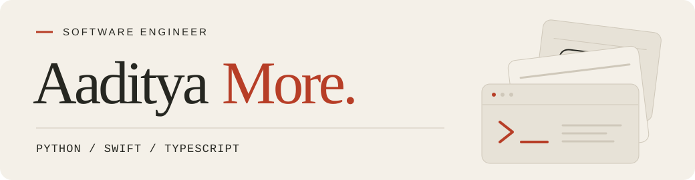

<a href="https://aadityamore.com/">
  <picture>
    <source media="(prefers-color-scheme: dark)" srcset="./assets/profile-dark.svg">
    <source media="(prefers-color-scheme: light)" srcset="./assets/profile-light.svg">
    
  </picture>
</a>

  <a href="https://aadityamore.com/"><strong>Website ↗</strong></a> &nbsp; · &nbsp;
  <a href="https://aadityamore.com/projects/">All projects</a> &nbsp; · &nbsp;
  <a href="https://aadityamore.com/resume/">Résumé</a> &nbsp; · &nbsp;
  <a href="https://www.linkedin.com/in/aadityavmore/">LinkedIn</a>

I'm a **software engineer at Dell Technologies**, based in Bengaluru. Outside work, I build tools for developers, interactive ways to learn, and little worlds you can play in.

## Selected work

<table>
<tr>
<td width="50%" valign="top">
<h3><a href="https://github.com/aaditya-v-more/claude-graft">Claude Graft ↗</a></h3>

Several Claude accounts. One Mac.

Separate profiles, shared Claude Code history, and live usage in your menu bar.

SWIFT · SWIFTUI · MACOS

<a href="https://graft.aadityamore.com/">Website & installation</a> · <a href="https://github.com/aaditya-v-more/claude-graft">Source</a>

</td>
<td width="50%" valign="top">
<h3><a href="https://github.com/aaditya-v-more/claude-ollama">Claude × Ollama ↗</a></h3>

Your desktop, your model gateway.

A launcher and proxy with accurate context limits, request pacing, and streaming-safe retries.

PYTHON · SHELL · REST APIS

<a href="https://aaditya-v-more.github.io/claude-ollama/">Website & installation</a> · <a href="https://github.com/aaditya-v-more/claude-ollama">Source</a>

</td>
</tr>
<tr>
<td width="50%" valign="top">
<h3><a href="https://github.com/aaditya-v-more/worldquant-orchestrator">WorldQuant Orchestrator ↗</a></h3>

From a research question to a backtest.

A Python CLI for data discovery, experiments and reviewable submission checks, with a SQLite audit trail.

PYTHON · SQLITE · AGENT WORKFLOWS

<a href="https://github.com/aaditya-v-more/worldquant-orchestrator">Source & walkthrough</a>

</td>
<td width="50%" valign="top">
<h3><a href="https://github.com/aaditya-v-more/devin-model-router">Devin Model Router ↗</a></h3>

A model choice for each message.

Route Devin CLI messages by expected cost and reliability targets, within one continuous session.

PYTHON · LLMS · AGENT CLIENT PROTOCOL

<a href="https://github.com/aaditya-v-more/devin-model-router">Source & design</a>

</td>
</tr>
</table>

DMR: co-built from an idea by Anil Maryala, with collaboration from Kartik S.

## Beyond developer tools

**[Play a little ↗](https://play.aadityamore.com/)** 
Build a kingdom in [The Emerald March](https://play.aadityamore.com/emerald-march/), explore [Mario in first person](https://play.aadityamore.com/mario/), or run the ruins in [Relic Run](https://play.aadityamore.com/relic-run/). Play directly in your browser.

**[Learn by doing ↗](https://learn.aadityamore.com/)** 
Explore tokenization, attention and training in [LLMs, from scratch](https://learn.aadityamore.com/llms/) and [D2L Interactive](https://learn.aadityamore.com/deep-learning/) — independent, unofficial companions to the books, with interactive diagrams and narrated chapters.

---

**A little background** 
B.Tech in Computer Science & Engineering, specializing in AI & ML · VIT Bhopal University · **9.32 CGPA**.

[More about me](https://aadityamore.com/about/) · [Let’s connect on LinkedIn](https://www.linkedin.com/in/aadityavmore/)
