<a href="https://aadityamore.com/">
  <picture>
    <source media="(max-width: 600px) and (prefers-color-scheme: dark)" srcset="./assets/showcase/hero-mobile-dark.svg">
    <source media="(max-width: 600px) and (prefers-color-scheme: light)" srcset="./assets/showcase/hero-mobile-light.svg">
    <source media="(prefers-color-scheme: dark)" srcset="./assets/showcase/hero-dark.svg">
    <source media="(prefers-color-scheme: light)" srcset="./assets/showcase/hero-light.svg">
    
  </picture>
</a>

  
  
  

I'm Aaditya, a **software engineer at Dell Technologies** in Bengaluru. I build native apps, tools for working with AI, and interactive things for the browser.

## Tools for the way I work

### [Claude Graft ↗](https://github.com/aaditya-v-more/claude-graft)

<a href="https://graft.aadityamore.com/">
  <picture>
    <source media="(max-width: 600px) and (prefers-color-scheme: dark)" srcset="./assets/showcase/graft-mobile-dark.svg">
    <source media="(max-width: 600px) and (prefers-color-scheme: light)" srcset="./assets/showcase/graft-mobile-light.svg">
    <source media="(prefers-color-scheme: dark)" srcset="./assets/showcase/graft-dark.svg">
    <source media="(prefers-color-scheme: light)" srcset="./assets/showcase/graft-light.svg">
    
  </picture>
</a>

Multiple Claude Desktop profiles, shared Claude Code history, and live usage in the menu bar. Built with **Swift & SwiftUI**.

**[Explore Graft](https://graft.aadityamore.com/)** &nbsp; / &nbsp; [Source](https://github.com/aaditya-v-more/claude-graft) &nbsp; / &nbsp; [Releases](https://github.com/aaditya-v-more/claude-graft/releases)

### [Claude × Ollama ↗](https://github.com/aaditya-v-more/claude-ollama)

<a href="https://aaditya-v-more.github.io/claude-ollama/">
  <picture>
    <source media="(max-width: 600px) and (prefers-color-scheme: dark)" srcset="./assets/showcase/ollama-mobile-dark.svg">
    <source media="(max-width: 600px) and (prefers-color-scheme: light)" srcset="./assets/showcase/ollama-mobile-light.svg">
    <source media="(prefers-color-scheme: dark)" srcset="./assets/showcase/ollama-dark.svg">
    <source media="(prefers-color-scheme: light)" srcset="./assets/showcase/ollama-light.svg">
    
  </picture>
</a>

A macOS launcher connecting Claude Desktop to Ollama, with accurate context limits, request pacing and streaming-safe retries.

**[Explore the launcher](https://aaditya-v-more.github.io/claude-ollama/)** &nbsp; / &nbsp; [Source](https://github.com/aaditya-v-more/claude-ollama)

### [WorldQuant Orchestrator ↗](https://github.com/aaditya-v-more/worldquant-orchestrator)

<a href="https://github.com/aaditya-v-more/worldquant-orchestrator">
  <picture>
    <source media="(max-width: 600px) and (prefers-color-scheme: dark)" srcset="./assets/showcase/wqo-mobile-dark.svg">
    <source media="(max-width: 600px) and (prefers-color-scheme: light)" srcset="./assets/showcase/wqo-mobile-light.svg">
    <source media="(prefers-color-scheme: dark)" srcset="./assets/showcase/wqo-dark.svg">
    <source media="(prefers-color-scheme: light)" srcset="./assets/showcase/wqo-light.svg">
    
  </picture>
</a>

A **Python CLI and agent skills** for data discovery, backtests and reviewable submission checks, with a SQLite audit trail.

**[Explore the workflow](https://github.com/aaditya-v-more/worldquant-orchestrator#-wqo-skills)** &nbsp; / &nbsp; [Source](https://github.com/aaditya-v-more/worldquant-orchestrator)

### [Devin Model Router ↗](https://github.com/aaditya-v-more/devin-model-router)

<a href="https://github.com/aaditya-v-more/devin-model-router">
  <picture>
    <source media="(max-width: 600px) and (prefers-color-scheme: dark)" srcset="./assets/showcase/router-mobile-dark.svg">
    <source media="(max-width: 600px) and (prefers-color-scheme: light)" srcset="./assets/showcase/router-mobile-light.svg">
    <source media="(prefers-color-scheme: dark)" srcset="./assets/showcase/router-dark.svg">
    <source media="(prefers-color-scheme: light)" srcset="./assets/showcase/router-light.svg">
    
  </picture>
</a>

Route Devin CLI messages by expected cost and reliability targets, within **one continuous session**.

**[Explore the router](https://github.com/aaditya-v-more/devin-model-router)** &nbsp; / &nbsp; [Source & design](https://github.com/aaditya-v-more/devin-model-router#readme)

Co-built from an idea by Anil Maryala, with collaboration from Kartik S.

## Curiosity takes other forms

<a href="https://play.aadityamore.com/">
  <picture>
    <source media="(max-width: 600px) and (prefers-color-scheme: dark)" srcset="./assets/showcase/play-mobile-dark.svg">
    <source media="(max-width: 600px) and (prefers-color-scheme: light)" srcset="./assets/showcase/play-mobile-light.svg">
    <source media="(prefers-color-scheme: dark)" srcset="./assets/showcase/play-dark.svg">
    <source media="(prefers-color-scheme: light)" srcset="./assets/showcase/play-light.svg">
    
  </picture>
</a>

**[The Emerald March](https://play.aadityamore.com/emerald-march/)** — build a kingdom. **[Mario, in first person](https://play.aadityamore.com/mario/)** — a different perspective. **[Relic Run](https://play.aadityamore.com/relic-run/)** — one more run.

**[Enter the arcade ↗](https://play.aadityamore.com/)**

<a href="https://learn.aadityamore.com/">
  <picture>
    <source media="(max-width: 600px) and (prefers-color-scheme: dark)" srcset="./assets/showcase/learn-mobile-dark.svg">
    <source media="(max-width: 600px) and (prefers-color-scheme: light)" srcset="./assets/showcase/learn-mobile-light.svg">
    <source media="(prefers-color-scheme: dark)" srcset="./assets/showcase/learn-dark.svg">
    <source media="(prefers-color-scheme: light)" srcset="./assets/showcase/learn-light.svg">
    
  </picture>
</a>

**[LLMs, from scratch](https://learn.aadityamore.com/llms/)** and **[D2L Interactive](https://learn.aadityamore.com/deep-learning/)** turn textbook ideas into interactive diagrams, experiments and narrated chapters. Independent, unofficial companions to the books.

**[Open the learning lab ↗](https://learn.aadityamore.com/)**

## Behind the projects

**Python · Swift · TypeScript · Shell · SQL** 
Native macOS apps · AI developer tools · APIs & automation · Interactive web experiences

B.Tech in Computer Science & Engineering, specializing in **AI & ML** · VIT Bhopal University · **9.32 CGPA**.

<a href="https://aadityamore.com/projects/">
  <picture>
    <source media="(max-width: 600px) and (prefers-color-scheme: dark)" srcset="./assets/showcase/footer-mobile-dark.svg">
    <source media="(max-width: 600px) and (prefers-color-scheme: light)" srcset="./assets/showcase/footer-mobile-light.svg">
    <source media="(prefers-color-scheme: dark)" srcset="./assets/showcase/footer-dark.svg">
    <source media="(prefers-color-scheme: light)" srcset="./assets/showcase/footer-light.svg">
    
  </picture>
</a>

  <a href="https://aadityamore.com/projects/">All projects</a> &nbsp; · &nbsp;
  <a href="https://aadityamore.com/about/">About me</a> &nbsp; · &nbsp;
  <a href="https://aadityamore.com/resume/">Résumé</a> &nbsp; · &nbsp;
  <a href="https://www.linkedin.com/in/aadityavmore/">LinkedIn</a>

